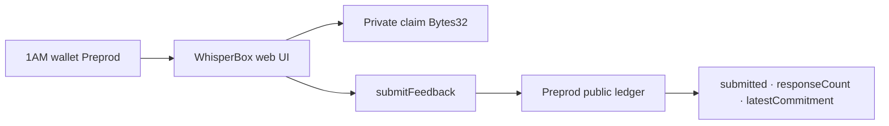

# WhisperBox

**Submit anonymous survey / feedback on Midnight Preprod: prove a response was cast without revealing the private rating on the public ledger.**

| | |
|---|---|
| Public repo | https://github.com/nikkunjtayal/whisper-box |
| Live demo | _(paste Vercel URL after deploy)_ |
| Demo video | [DEMO_VIDEO.md](docs/evidence/DEMO_VIDEO.md) _(paste Drive/YouTube when ready)_ |
| Product idea | **Anonymous Feedback / Survey** |
| Preprod contract | See table below · label **Preprod** |
| Commits on `main` | ≥8 meaningful (Level 2) |
| Tests | **Vitest** (`npm test`) |

WhisperBox is a Midnight Compact contract + **1AM** frontend for anonymous survey participation. The rating stays in a private witness; observers only see whether a valid response was submitted, how many responses ran, and a commitment hash.

## Levels overview

| Level | Theme | Status |
|---|---|---|
| Level 1 — New Moon | Compile, tests, Preview path | ✅ |
| Level 2 — Waxing Crescent | 1AM UI, Preprod, circuit call, live demo | ✅ (this pass) |
| Level 3 — First Quarter | CI/CD, polish, proposal, screenshots, video | ⏳ Out of scope this pass |

---

## Checklist — Level 2 (Waxing Crescent)

| # | Requirement | Status | Where |
|---|---|---|---|
| 1 | Midnight.js SDK + `dapp-connector-api` | ✅ | `web/src/lib/providers.ts` |
| 2 | Providers: level privateState, indexer, FetchZkConfig, proof, wallet, midnight | ✅ | `providers.ts` |
| 3 | Wallet bridge: ConnectedAPI → balanceUnsealed + submitTransaction | ✅ | `walletAdapter.ts` |
| 4 | Circuit wrappers: deploy / join / callTx | ✅ | `whisperApi.ts` |
| 5 | 1AM connect + disconnect (`window.midnight['1am']`) | ✅ | `selectWallet.ts` + hook |
| 6 | Address display + error + loading/busy states | ✅ | `App.tsx` |
| 7 | Circuit `submitFeedback` called directly from UI | ✅ | Call submitFeedback button |
| 8 | Local/browser proving via dapp-connector proof provider (HTTP fallback) | ✅ | `providers.ts` |
| 9 | Private rating never on public panel; cleared after success | ✅ | App privacy UX |
| 10 | Live demo on Vercel | ⏳ | Fill after deploy |
| 11 | Valid Preprod 64-hex address documented | ⏳ | `DEPLOYMENT.md` after UI deploy |
| 12 | Clear privacy model in README | ✅ | Section below |
| 13 | ≥8 meaningful commits on main | ✅ | Aim 8+ |
| 14 | Vitest green (≥6 tests) | ✅ | artifacts, ledger, submitted T/F, encoding |
| 15 | `setNetworkId('preprod')` | ✅ | `config.ts` + wallet hook |

---

## Privacy model — what an observer can and cannot learn

| Data | Visibility | Where it lives | Notes |
|---|---|---|---|
| Private claim (`Bytes<32>`) | **PRIVATE** (witness) | Prover / 1AM session | Bytes 0..7 = LE `u64` rating; bytes 24..31 = `WhisperB`. Never cleartext on ledger. |
| Circuit `rating` param | **PRIVATE** | Circuit witness | Must match claim encoding. UI labels this field **PRIVATE**. |
| `submitted` | **PUBLIC** after `disclose()` | Ledger | Demo rule: `rating >= 1 && rating <= 5`. |
| `responseCount` | **PUBLIC** | Ledger `Counter` | Increments on every `submitFeedback`. |
| `latestCommitment` | **PUBLIC** after `disclose()` | Ledger | `persistentHash(claim)` — commitment, not the rating. |

**Observer learns:** that a response ran, whether it was in the valid survey range, a commitment hash, and the response count.  
**Observer cannot learn:** the rating value, comment payload bytes, or any cleartext claim. Level 2 does **not** publish per-option tallies.

---

## Architecture



---

## Preprod deployment

| Field | Value |
|---|---|
| Network label | **Preprod** |
| Contract address (64-hex) | Recorded in [`docs/evidence/DEPLOYMENT.md`](./docs/evidence/DEPLOYMENT.md) — paste after UI deploy |
| Indexer | `https://indexer.preprod.midnight.network/api/v4/graphql` |
| Live app | _(Vercel URL)_ |

Deploy from the UI (**Connect 1AM → Deploy to Preprod**) then paste the 64-hex into `DEPLOYMENT.md`, this README table, and optional `VITE_CONTRACT_ADDRESS` for auto-join.

---

## Quick start

```bash
npm install
npm test
npm run web:sync-zk
npm --prefix web install
npm run web:dev
```

Compact compile (WSL): `npm run compile:wsl`

## License

MIT © nikkunjtayal
