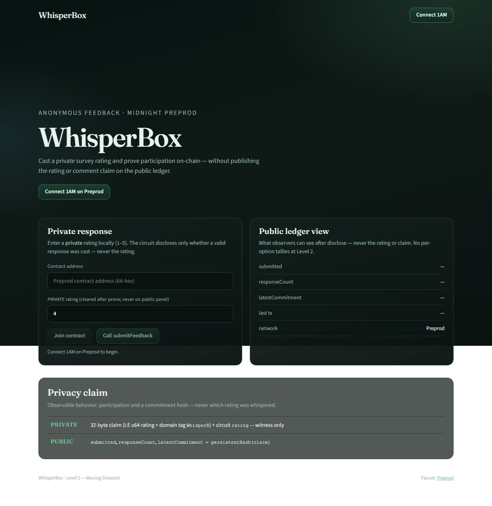
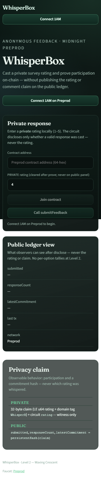
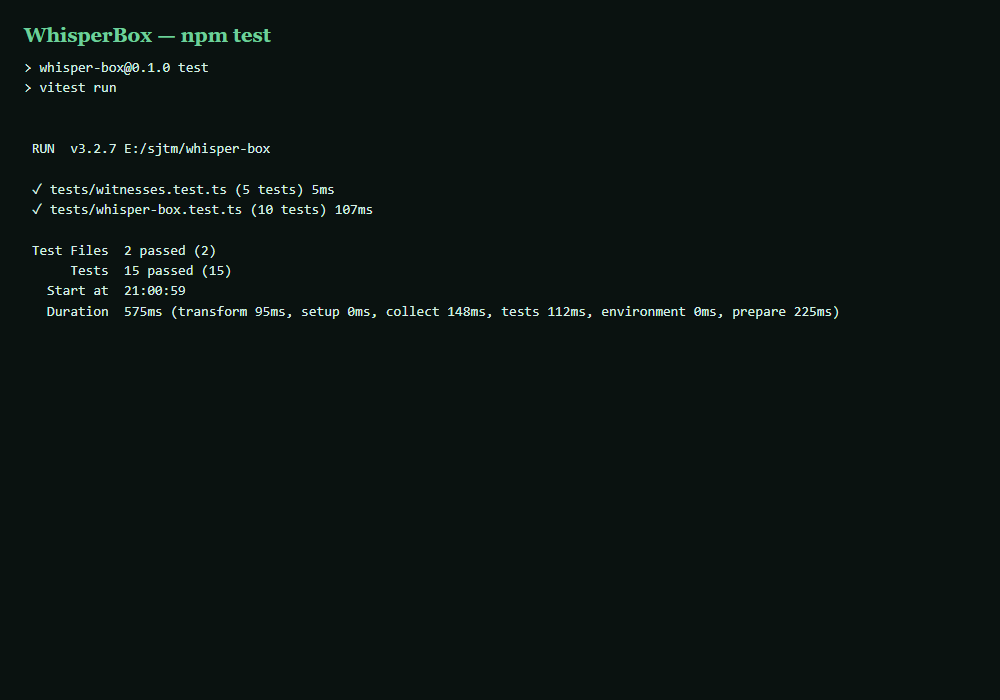
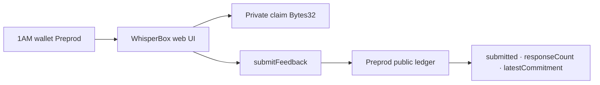

# WhisperBox

[](https://github.com/nikkunjtayal/whisper-box/actions/workflows/ci.yml)

**Submit anonymous survey / feedback on Midnight Preprod: prove a response was cast without revealing the private rating on the public ledger.**

| | |
|---|---|
| Public repo | https://github.com/nikkunjtayal/whisper-box |
| Live demo | https://whisper-box-kappa.vercel.app |
| Demo video | [DEMO_VIDEO.md](docs/evidence/DEMO_VIDEO.md) _(paste Drive/YouTube when ready)_ |
| Product idea | **Anonymous Feedback / Survey** ([proposal](docs/evidence/PRODUCT_PROPOSAL.md)) |
| Preprod contract | See table below · label **Preprod** |
| Commits on `main` | ?10 meaningful (Level 3) |
| Tests | **15 passing** (`npm test`) |
| CI | Passing on every push to `main` |

WhisperBox is a Midnight Compact contract + **1AM** frontend for anonymous survey participation. The rating stays in a private witness; observers only see whether a valid response was submitted, how many responses ran, and a commitment hash.

## Levels overview

| Level | Theme | Status |
|---|---|---|
| Level 1 ? New Moon | Compile, tests, Preview path | ? Verified |
| Level 2 ? Waxing Crescent | 1AM UI, Preprod, circuit call, live demo | ? Verified |
| Level 3 ? First Quarter | CI/CD, polish, proposal, screenshots, video structure | ? Verified |
| Idea Submission (L4?6) | Anonymous Feedback / Survey ? Consumer focus | ? Copy ready |

---

## Checklist ? Level 1 (New Moon)

| # | Requirement | Status | Where |
|---|---|---|---|
| 1 | New Midnight Compact product (not a clone rename) | ? | `contracts/whisper-box.compact` |
| 2 | Compact `+0.31.1` managed artifacts | ? | `contracts/managed/whisper-box/` |
| 3 | ?3 tests passing | ? | **15** Vitest (`tests/`) |
| 4 | Compile / artifact evidence | ? | managed keys + zkir committed |
| 5 | Public GitHub repo | ? | nikkunjtayal/whisper-box |
| 6 | README with product + privacy claim | ? | This file |
| 7 | ?5 meaningful commits | ? | 10+ on `main` |
| 8 | MIT license | ? | `LICENSE` |

---

## Checklist ? Level 2 (Waxing Crescent)

| # | Requirement | Status | Where |
|---|---|---|---|
| 1 | Frontend dApp wired to deployed contract | ? | `web/` + Preprod deploy/join |
| 2 | Wallet connect / disconnect | ? | 1AM (`selectWallet` + topbar) |
| 3 | Circuit call from UI | ? | `Call submitFeedback` |
| 4 | Privacy UX (public submitted/count/commitment only) | ? | Public ledger panel + rating cleared |
| 5 | Preprod contract address | ? | Table below + `DEPLOYMENT.md` |
| 6 | Live demo URL | ? | https://whisper-box-kappa.vercel.app |
| 7 | Demo video structure | ? | `docs/evidence/DEMO_VIDEO.md` |
| 8 | ?8 meaningful commits | ? | 10+ |
| 9 | README privacy model | ? | Section below |
| 10 | `dapp-connector-api` + midnight-js providers | ? | `web/src/lib/providers.ts` |

---

## Checklist ? Level 3 (First Quarter)

| # | Requirement | Status | Where |
|---|---|---|---|
| 1 | Fully functional privacy dApp | ? | Live + Preprod path |
| 2 | ?10 Vitest tests (circuits, ledger, witness encoding) | ? | **15** tests |
| 3 | CI/CD workflow + badge + passing runs | ? | [Actions](https://github.com/nikkunjtayal/whisper-box/actions/workflows/ci.yml) |
| 4 | Idea from provided list | ? | **Anonymous Feedback / Survey** |
| 5 | Product proposal for approval | ? | [PRODUCT_PROPOSAL.md](docs/evidence/PRODUCT_PROPOSAL.md) |
| 6 | ?10 meaningful commits | ? | 10+ |
| 7 | Public GitHub + complete README | ? | This repo |
| 8 | Live demo link | ? | Vercel |
| 9 | Test output screenshot | ? | `docs/screenshots/test-results.png` |
| 10 | Desktop + mobile screenshots | ? | `docs/screenshots/*-live.png` |
| 11 | Demo video (link when uploaded) | ? | Structure ready in DEMO_VIDEO.md |
| 12 | Privacy model / observer view | ? | Below |
| 13 | Code quality audit | ? | [CODE_QUALITY.md](docs/evidence/CODE_QUALITY.md) |

**Self-verify:** `npm test` ? 15/15 · `npm --prefix web run build` ? OK · CI on `main` ? success.

---

## Screenshots

### Desktop live demo



### Mobile responsive (390×844)



### Tests ? 15 passing



---

## Privacy model ? what an observer can and cannot learn

| Data | Visibility | Where it lives | Notes |
|---|---|---|---|
| Private claim (`Bytes<32>`) | **PRIVATE** (witness) | Prover / 1AM session | Bytes 0..7 = LE `u64` rating; bytes 24..31 = `WhisperB`. Never cleartext on ledger. |
| Circuit `rating` param | **PRIVATE** | Circuit witness | Must match claim encoding. UI labels this field **PRIVATE**. |
| `submitted` | **PUBLIC** after `disclose()` | Ledger | Demo rule: `rating >= 1 && rating <= 5`. |
| `responseCount` | **PUBLIC** | Ledger `Counter` | Increments on every `submitFeedback`. |
| `latestCommitment` | **PUBLIC** after `disclose()` | Ledger | `persistentHash(claim)` ? commitment, not the rating. |

**Observer learns:** that a response ran, whether it was in the valid survey range, a commitment hash, and the response count.  
**Observer cannot learn:** the rating value, comment payload bytes, or any cleartext claim. Level 2/3 do **not** publish per-option tallies.

---

## Architecture



---

## CI/CD

Every push / PR to `main` runs:

1. `npm ci`
2. `npm test`
3. `npm run web:sync-zk`
4. `npm --prefix web ci`
5. `npm --prefix web run build`

Workflow: [`.github/workflows/ci.yml`](./.github/workflows/ci.yml)

Compact compile stays local/WSL (`npm run compile:wsl`); managed artifacts are committed.

---

## Preprod deployment

| Field | Value |
|---|---|
| Network label | **Preprod** |
| Contract address (64-hex) | Recorded in [`docs/evidence/DEPLOYMENT.md`](./docs/evidence/DEPLOYMENT.md) ? paste after UI deploy |
| Indexer | `https://indexer.preprod.midnight.network/api/v4/graphql` |
| Live app | https://whisper-box-kappa.vercel.app |

Deploy from the UI (**Connect 1AM ? Deploy to Preprod**) then paste the 64-hex into `DEPLOYMENT.md`, this README table, and optional `VITE_CONTRACT_ADDRESS` for auto-join. Do **not** reuse NightGate or ShadePass addresses ? WhisperBox is a separate survey contract.

---

## Idea Submission paste

Copy Q1 / Q2 answers from [`docs/evidence/PRODUCT_PROPOSAL.md`](docs/evidence/PRODUCT_PROPOSAL.md).

Category: **Consumer focus** · Idea: **Anonymous Feedback / Survey**

---

## Quick start

```bash
npm install
npm test
npm run web:sync-zk
npm --prefix web install
npm run web:dev
```

## License

MIT © nikkunjtayal

---

Built for Midnight **New Moon to Full** ? Level 3 First Quarter.
